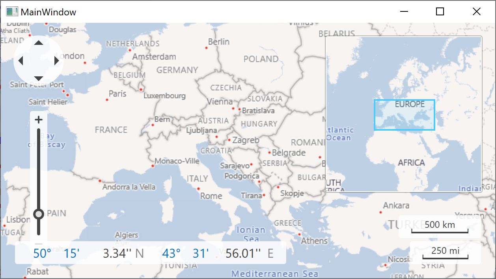

<!-- default badges list -->

<!-- default badges end -->

# Map for WPF - Load Image Tiles to a Map

The example shows how to connect a map to the [Bing Maps](https://www.bing.com/maps/?cp=40.195659%7E44.495316&lvl=11.0) imagery service and load image tiles. It also shows how to configure main map settings like the center point and zoom level.

Note that if you run this sample as is, you will get a warning message saying that the specified Bing Maps key is invalid. To learn more about Bing Map keys, please refer to the [How to: Get a Bing Maps Key](http://help.devexpress.com/#WPF/CustomDocument10974) tutorial.

## Files to Review

* [MainWindow.xaml](./CS/Wpf_MapControl_Lesson1/MainWindow.xaml) (VB: [MainWindow.xaml](./VB/Wpf_MapControl_Lesson1/MainWindow.xaml))

## Documentation

* [Lesson 1 - Load Image Tiles to a Map](https://docs.devexpress.com/WPF/10883/controls-and-libraries/map-control/getting-started/lesson-1-load-image-tiles-to-a-map)
<!-- feedback -->
## Does this example address your development requirements/objectives?

 

(you will be redirected to DevExpress.com to submit your response)
<!-- feedback end -->
